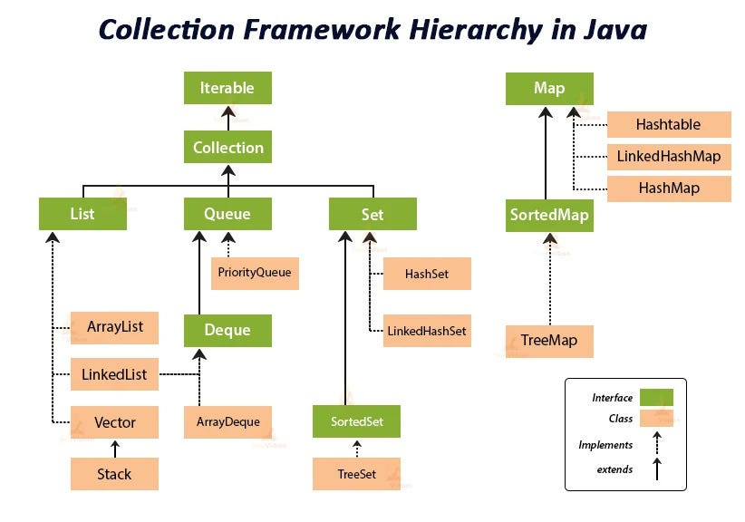
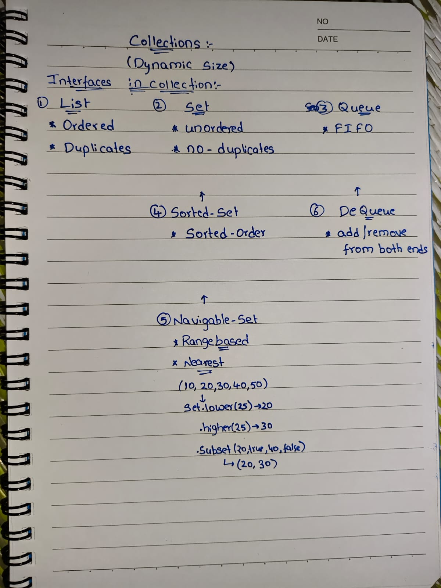
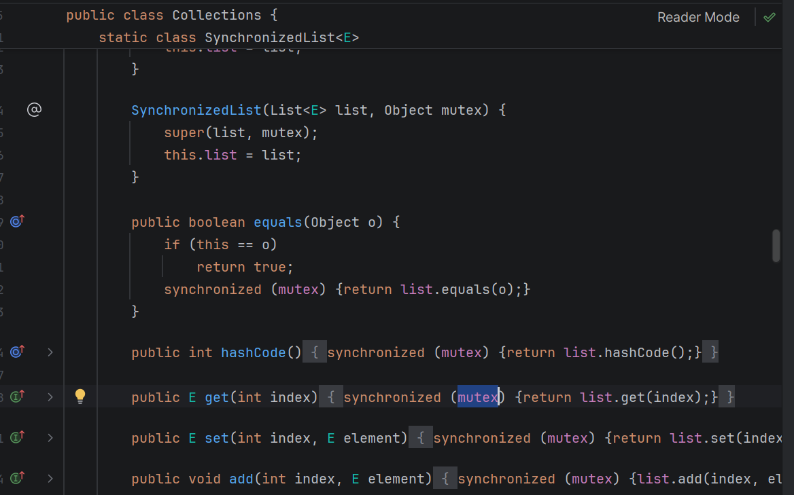
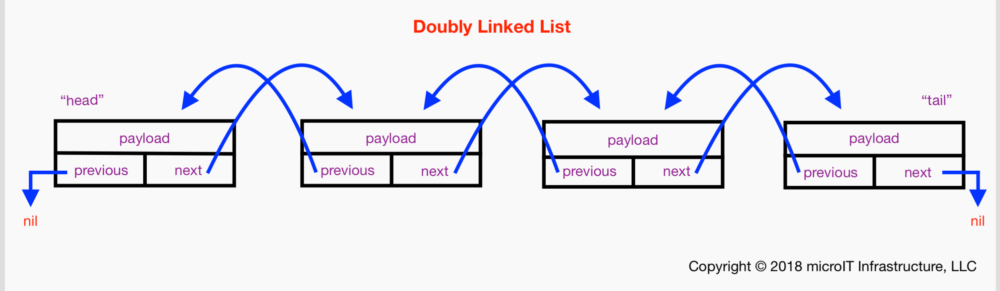
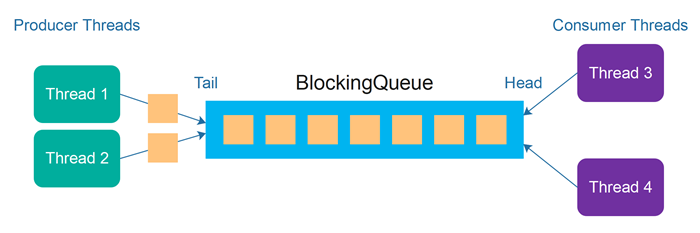

## Before java 1.2
- Arrays only
- Fixed size
- No built-in utilities

## After 1.2
1. Dynamic resizing
2. Searching
3. Sorting
4. Thread-safe versions
5. Common APIs






### List


## ArrayList

 - ordered
 - allow duplicates
 - allow nulls
 - index based
 - continuous memory location
 - Object[] elementData  ( internal structure)
 - Arrays.copy(oldaraay , newAraay)  --> old+old>>1 (50 % grows)

```textmate
| Operation   | Time              |
| ----------- | --------------    |
| get(i)      | O(1)              |
| add(end)    | O(1) amortized/O(n) when array full    |
| add(mid)    | O(n)              |
| remove(mid) | O(n)              |

```


### Thread safe List

### synchronizedList vs CopyOnWriteArrayList vs Vector

## synchronized List

- Collections.synchronizedList()
- It does NOT create a new list.
- Creates a wrapper class
- creates lock on each method of list class (using synchronized)
    


- synchronizedList uses a single lock for all operations, so even reads and writes cannot run concurrently. However, iteration consists of multiple method calls, and the lock is released between those calls, allowing other threads to modify the list. Hence we must manually synchronize the whole iteration.

- Iteration needs manual lock:
```text
synchronized(list) {
for(Integer i : list)
}
```

<details>
<summary>why?</summary>

```text

Iterator<Integer> it = list.iterator();
while(it.hasNext()) {
    it.next();
}
hasNext()  -> lock/unlock
next()     -> lock/unlock
hasNext()  -> lock/unlock
next()     -> lock/unlock
hasNext()  -> lock/unlock ---> what here lock goes to another thread where it add/remove some data , list structures changes --> concurrent modification/IndexOutOfBoundsException errors
next()     -> lock/unlock

for loops:
size()  -> lock/unlock
get(0)  -> lock/unlock
size()  -> lock/unlock    ---> what here lock goes to another thread where it add/remove some data , list structures changes --> concurrent modification/IndexOutOfBoundsException errors
get(1)  -> lock/unlock
size()  -> lock/unlock
get(2)  -> lock/unlock

```
</details>

each method is synchronized -> 1 lock shared between methods

- int size = sal.size();
  for(int i=0;i<size;i++){  --> may get indexout of bound if we remove inside for loop
- 
- for(int i=0;i<sal.size();i++){ --> may not get --> but data processed was not right --> size changes for each iteration

- Iterator<Integer> iterator = sal.iterator();
  while(iterator.hasNext()){
  System.out.println(iterator.next());
  sal.remove(7);
  }  --> concurrent Modification error


## CopyOnWriteArrayList

- CopyOnWriteArrayList is a thread-safe ArrayList where every write operation creates a new copy of the array.
- CopyOnWriteArrayList is a thread-safe list where every write operation copies the underlying array, providing fast lock-free reads and fail-safe iteration, but slow writes.
- ```text
     Read → normal
     Write → copy whole array → modify → replace

   ```

- When to Use? (Interview favorite)
```text
✅ many reads
✅ very few writes
✅ multithreaded
✅ iteration heavy
examples:
caching
configuration lists
subscribers list
event listeners
```

- Avoid when:
```text
❌ frequent writes
❌ large list
❌ memory sensitive

Because every write copies full array.
```


### Linked List

- LinkedList is a doubly linked list that provides O(1) insertions and deletions but O(n) random access, making it suitable for frequent modifications but not for indexing
- 
- ```java
    class Node {
    E item;
    Node next;
    Node prev;
    }  
  ```
- A ↔ B ↔ C ↔ D
- ```text
   | Operation         | Complexity |
   | ----------------- | ---------- |
   | get(index)        | O(n)       | need to travel whole list
   | add() end         | O(1)       |
   | add first         | O(1)       |
   | remove first/last | O(1)       |
   | add(index)        | O(n)       | need to travel to that index and add
   | search            | O(n)       | need to travel
  ```

- <details>
   <summary>implements List + Deque + Queue</summary>
  
    - Works as Stack + Queue
      ```java
        addFirst();
        addLast();
        removeFirst();
        removeLast();
        push();
        pop();
        offer();
        poll();
        ```
</details>


### Thread-Safe LinkedList

1. Collections.synchronizedList()
```java
List<Integer> list =
    Collections.synchronizedList(new LinkedList<>());

/*How it works?
Wrapper adds one mutex lock
All methods synchronized  */
synchronized(list){
        for(Integer x : list){
        System.out.println(x);
    }
}

/*       Iteration still needs manual sync */
```

2. Manual synchronization
```java
List<Integer> list = new LinkedList<>();
synchronized(list){
    list.add(10);
}
```
3. ConcurrentLinkedDeque
   - Lock-free
```java
ConcurrentLinkedDeque<Integer> dq = new ConcurrentLinkedDeque<>();
dq.addFirst(1);
dq.addLast(2);
```
```text
Pros:
✔ no locks
✔ very fast
✔ high concurrency

Cons:
❌ no random access
```


<details>
<summary>working:</summary>

```text
ConcurrentLinkedDeque is a lock-free, CAS-based, thread-safe deque that allows multiple threads to update concurrently without blocking, giving better scalability than synchronized collections.

class Node {
   volatile E item;
   volatile Node next;
   volatile Node prev;
}
volatile --> visibility between threads
CAS (Atomic update)

    if(current == expected)
       update
    else
       retry  --> Done atomically by CPU
       
With locks:
Thread1 holds lock
Thread2 waits
Thread3 waits

With CAS:
Thread1 try
Thread2 try
Thread3 try
only conflicts retry

```
</details>


<details>
<summary>why ConcurrentLinkedDeque not supports get(index)</summary>

```text
get(index) is NOT supported in ConcurrentLinkedDeque
Because ConcurrentLinkedDeque is a lock-free linked structure designed for O(1) head/tail operations. Supporting get(index) would require traversal and locking, which breaks its non-blocking concurrency design.

REAL Reason → Concurrency + Lock-free design
Problem

While you traverse:

Thread A → walking nodes
Thread B → removes node
Thread C → adds node

Now:
index changes mid-traversal

Results:
❌ inconsistent
❌ incorrect
❌ unsafe

To support get(index), we must:
lock entire list

But:
Lock = blocking
blocking = slow
slow = defeats purpose
👉 breaks lock-free design
```
 
</details>


4. LinkedBlockingQueue
```java
LinkedBlockingQueue<Integer> q = new LinkedBlockingQueue<>();
q.put(10);
q.take();
```
```text
Pros:
✔ thread-safe
✔ blocking support
✔ producer-consumer ideal

Cons:
❌ slightly slower
```


<details>
<summary>working</summary>

```text
LinkedBlockingQueue is a thread-safe, blocking, linked-node queue that uses two locks (putLock and takeLock) and conditions to allow producers and consumers to work concurrently.

A FIFO blocking queue used mainly for:

Producer → Consumer
Thread pools
Task queues
Messaging

```
</details>




<details>
<summary>internals:</summary>

```text
Singly Linked List (nodes)

class Node<E> {
   E item;
   Node<E> next;
}

putLock   → for producers
takeLock  → for consumers

notFull  → wait when full
notEmpty → wait when empty

LinkedBlockingQueue<Integer> q =
        new LinkedBlockingQueue<>(5);

q.put(10);   // blocks if full
q.take();    // blocks if empty
```
</details>


<details>
<summary>uses:</summary>

```text
✅ producer-consumer pattern
✅ bounded capacity
✅ backpressure needed
✅ thread pools
✅ task scheduling
```
</details>


### SETS

## HashSet

- HashSet is an unordered collection that stores unique elements using hashing and provides O(1) average time for add, remove, and contains.
-

<details>
<summary>HashSet internally</summary>

```text
uses hashmap internally
element → key
dummy → value

private transient HashMap<E,Object> map;
private static final Object PRESENT = new Object();

hashCode() -->find bucket index
equals()   --> check duplicates
store key

if collision --> bucket → linked list (or tree)
```

```text
| Operation | Average | Worst |
| --------- | ------- | ----- |
| add       | O(1)    | O(n)  |
| remove    | O(1)    | O(n)  |
| contains  | O(1)    | O(n)  |

Worst case = all elements same bucket

(Java 8+ uses tree → O(log n))
```
</details>


## LinkedHashSet

- maintains inserton order
- LinkedHashSet maintains insertion order by combining hashing (HashSet) with a doubly linked list that connects all elements.


<details>
<summary>Internal:</summary>

```text
LinkedHashSet → LinkedHashMap
1️⃣ Hash table (fast lookup)
2️⃣ Doubly linked list (order maintenance)
```
```java
class Entry extends HashMap.Node {
Entry before;
Entry after;
}
```
```text
bucket link (for hashing)
+
before/after (for order)
```
```text
//example
set.add(10);

Step 1: hashCode() → find bucket
Step 2: equals() → check duplicate
Step 3: Insert into hash table
Step 4: Attach at end of linked list
```
</details>


### TreeSET
- TreeSet stores unique elements in sorted order using a self-balancing Red-Black Tree, giving O(log n) time for add, remove, and search.
- ✔ sorted order
  - ✔ unique
  - ✔ fast search (log n)
- TreeSet → TreeMap
- no nulls  --> comparsiion issues


| Set               | Internal DS        | Order     | Thread-safe | Time Complexity | Pros            | Cons        | When to use         |
| ----------------- | ------------------ | --------- | ----------- | --------------- | --------------- | ----------- | ------------------- |
| **HashSet**       | Hash table         | ❌ none    | ❌           | O(1) avg        | fastest, simple | no order    | general use         |
| **LinkedHashSet** | Hash + linked list | insertion | ❌           | O(1)            | keeps order     | more memory | ordered unique list |
| **TreeSet**       | Red-Black tree     | sorted    | ❌           | O(log n)        | sorted data     | slower      | sorted elements     |


| Approach                             | How                    | Locking          | Performance                  | Pros                                           | Cons                       | Best for           |
| ------------------------------------ | ---------------------- | ---------------- | ---------------------------- | ---------------------------------------------- | -------------------------- | ------------------ |
| **Collections.synchronizedSet**      | wrapper around any set | single lock      | medium                       | easy, minimal code                             | blocking, poor scalability | small apps         |
| **ConcurrentHashMap `.newKeySet()`** | map-backed set         | fine-grained/CAS | ⭐ fastest                    | scalable, high concurrency, non-blocking reads | no order                   | production systems |
| **CopyOnWriteArraySet**              | copy-on-write array    | no lock for read | read ⭐ fastest, write ❌ slow | fail-safe iteration, no locks for read         | memory heavy, slow writes  | read-heavy systems |
| Manual `synchronized`                | custom lock blocks     | depends          | varies                       | full control                                   | error-prone                | rare cases         |
| `synchronizedSortedSet(TreeSet)`     | wrapper                | single lock      | medium                       | sorted + thread-safe                           | blocking                   | small sorted sets  |

Reads heavy
CopyOnWriteArraySet  > ConcurrentHashMap.newKeySet > synchronizedSet

Writes heavy
ConcurrentHashMap.newKeySet > synchronizedSet > CopyOnWriteArraySet


## Queues:
| Queue                     | Internal (Uses)        | Thread-safe | Locking              | Blocking | Order            | Performance          | Where to use                      |
| ------------------------- | ---------------------- | ----------- | -------------------- | -------- | ---------------- | -------------------- | --------------------------------- |
| **ArrayDeque**            | circular dynamic array | ❌           | none                 | ❌        | FIFO             | ⭐ fastest            | single-thread apps                |
| **LinkedList**            | doubly linked list     | ❌           | none                 | ❌        | FIFO             | medium               | simple queue                      |
| **PriorityQueue**         | binary heap            | ❌           | none                 | ❌        | priority         | O(log n)             | task scheduling                   |
| **ArrayBlockingQueue**    | circular array         | ✔           | single lock          | ✔        | FIFO             | medium               | fixed-size producer-consumer      |
| **LinkedBlockingQueue**   | linked nodes           | ✔           | two locks (put/take) | ✔        | FIFO             | ⭐ high               | thread pools, producers-consumers |
| **PriorityBlockingQueue** | heap                   | ✔           | lock                 | ✔        | priority         | medium               | priority tasks                    |
| **DelayQueue**            | heap + time            | ✔           | lock                 | ✔        | delay-based      | medium               | scheduled jobs                    |
| **ConcurrentLinkedQueue** | linked list            | ✔           | CAS (lock-free)      | ❌        | FIFO             | ⭐ fastest concurrent | high throughput systems           |
| **ConcurrentLinkedDeque** | doubly linked list     | ✔           | CAS (lock-free)      | ❌        | FIFO + both ends | ⭐ fastest concurrent | work-stealing, task queues        |


