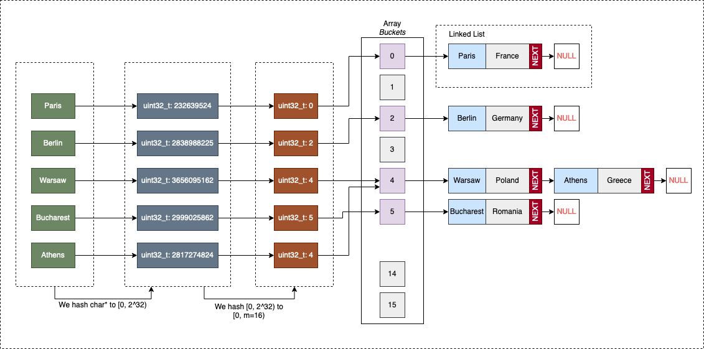

## MAPS

### HashMap

- HashMap stores key-value pairs using hashing for O(1) average insert, search, and delete.
- key → hashCode() → bucket index → store value
- no order, 1 null key, not thread safe

```java
Map<String, Integer> map = new HashMap<>();

map.put("A", 10);
map.get("A");
map.remove("A");

```

<details>
<summary>Internal Structure</summary>

```text
Node<K,V>[] table

# Bucket:
Linked List → if small <8
Red-Black Tree → if large >8

```

```java
static class Node<K,V> {
    int hash;
    K key;
    V value;
    Node<K,V> next;
}

```

```text
HashMap
   ↓
Array
   ↓
Bucket
   ↓
LinkedList (≤8)
   ↓
RedBlackTree (>8)
   ↓
Resize when 75%

```

</details>

<details>
<summary>how put works</summary>

```text

1️⃣ hash()
n=capacity of hashmap
hash = key.hashCode()
hash = hash ^ (hash >>> 16)
Better bit distribution. (mix higher bits and lower bits)

2️⃣ index
index = hash & (n-1)   --> n always power of 2
(faster than %)

3️⃣ If empty → insert

4️⃣ If collision
equals() check
→ update OR chain

5️⃣ If bucket size > 8
Linked list → Red-Black Tree

👉 improves from O(n) → O(log n)
```
</details>

<details>
<summary>Resize</summary>

```text
capacity = 16
loadFactor = 0.75

when:
  size > capacity * loadFactor
  
then:
    resize 2x
    rehash all elements   --> o(n)
```
</details>


<details>
<summary>equals() & hashCode() Rule </summary>

```text
equals true → hashCode must same

otherwise:
    * duplicate keys OR lookup fails
```
</details>


## LinkedHashMap

- LinkedHashMap is a HashMap + Doubly Linked List that maintains insertion (or access) order while still providing O(1) average lookup.
- ✔ preserves order
- ✔ still fast (O(1))

<details>
<summary> internal</summary>

```text
HashMap (buckets)
+
Doubly Linked List (order)
```
```java
static class Entry<K,V> extends HashMap.Node<K,V> {
    Entry<K,V> before, after;
}

```
```text
key, value, hash, next  (HashMap)
+
before, after          (order list)
```
</details>
## TREE MAP

- TreeMap stores key-value pairs in a Red-Black Tree, keeping keys sorted with O(log n) operations for insert, search, and delete.
- sorted
- no null keys
- ❌ array
  ❌ hash
- uses Red-Black Tree (Self-balancing BST)

<details>
<summary>Internal Data Structure </summary>

```text
Red-Black Tree (Self-balancing BST)

```
```java
static final class Entry<K,V> {
    K key;
    V value;
    Entry<K,V> left;
    Entry<K,V> right;
    Entry<K,V> parent;
    boolean color; // RED or BLACK
}

```
```text
key + value + 3 pointers + color
1️⃣ Compare with root
if key < root → go left
if key > root → go right

(BST rule)

2️⃣ Find correct position
Insert node

3️⃣ Fix balance
recolor
rotate left/right


(Red-Black rules)
```
</details>
<details>
<summary> </summary>


</details>
<details>
<summary> </summary>


</details>