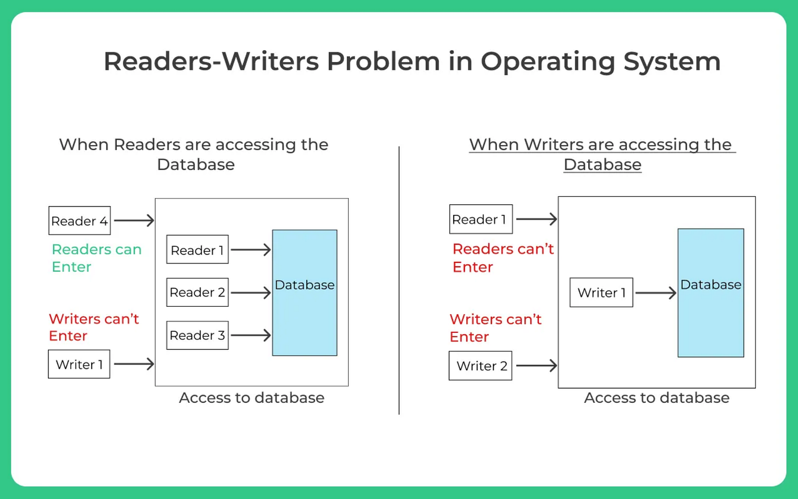

# Java Threads & Concurrency – Complete Notes (10+ Years Experience)

> **Audience**: Senior Java Engineers (8–12 yrs)
>
> **Scope**: Core Java concurrency concepts, JVM internals, locking strategies, performance, and industry standards (Java 8–21)

---

## 1. What is a Thread?
A **thread** is the smallest unit of execution within a process. Multiple threads share:
- Heap memory
- Method area

Each thread has:
- Its own stack
- Program counter

```
Process
 ├── Thread-1 (Stack-1)
 ├── Thread-2 (Stack-2)
 └── Thread-3 (Stack-3)
        ↓
      Shared Heap
```

---

## 2. Process vs Thread (Quick Recall)
| Aspect | Process | Thread |
|------|--------|-------|
| Memory | Separate | Shared |
| Context switch | Heavy | Lightweight |
| Communication | IPC | Shared memory |
| Failure impact | Isolated | Can crash process |

---

## 3. Thread Lifecycle (JVM Level)

```
NEW
 ↓ start()
RUNNABLE  <──────┐
 ↓              │
BLOCKED         │
 ↓              │
WAITING         │
 ↓              │
TIMED_WAITING   │
 ↓              │
TERMINATED ─────┘
```

### Key Points
- **RUNNABLE** = ready or running (OS decides)
- **BLOCKED** = waiting for monitor lock
- **WAITING** = wait(), join()
- **TIMED_WAITING** = sleep(), wait(timeout)

---

## 4. Thread Creation Methods

### 4.1 Extending Thread (NOT recommended)
```java
class MyThread extends Thread {
    public void run() {}
}
```

### 4.2 Implementing Runnable (Preferred)
```java
new Thread(() -> doWork()).start();
```

### 4.3 Executor Framework (Industry Standard)
```java
ExecutorService es = Executors.newFixedThreadPool(10);
es.submit(() -> doWork());
```

### 4.4 Callable + Future
```java
Future<Integer> f = es.submit(() -> 42);
f.get();
```

### 4.5 CompletableFuture (Modern)
```java
CompletableFuture.supplyAsync(this::call)
    .thenApply(this::transform)
    .thenAccept(System.out::println);
```

---

## 5. Thread Safety – Core Idea
> **A class is thread-safe if it behaves correctly when accessed concurrently without external synchronization.**

---

## 6. Locking & Synchronization (CORE SECTION)

### 6.1 synchronized (Intrinsic Lock)

```java
synchronized (lock) {
    criticalSection();
}
```

- Lock is on **object monitor**
- Reentrant
- Blocking

#### JVM Optimizations
- Biased locking
- Lightweight lock
- Heavyweight lock

---

### 6.2 synchronized Method
```java
public synchronized void increment() {}
```

Lock = `this`

---

### 6.3 Static synchronized
```java
public static synchronized void update() {}
```

Lock = `Class object`

---

## 7. Explicit Locks (java.util.concurrent.locks)

### 7.1 ReentrantLock (Industry Preferred)
```java
Lock lock = new ReentrantLock();
lock.lock();
try {
    critical();
} finally {
    lock.unlock();
}
```

#### Advantages over synchronized
- tryLock()
- fairness
- interruptible

---

### 7.2 Fair vs Non-Fair Lock
| Type | Meaning |
|----|-------|
| Fair | FIFO ordering |
| Non-Fair | Higher throughput (default) |

---

### 7.3 ReadWriteLock
```java
ReadWriteLock rw = new ReentrantReadWriteLock();
```

- Multiple readers allowed
- Single writer exclusive

Used in:
- Caches
- Configuration data



---

### 7.4 StampedLock (Java 8+)
```java
long stamp = lock.tryOptimisticRead();
```

- Optimistic locking
- NOT reentrant
- High-performance read-heavy systems

---

## 8. Lock-Free & Atomic Operations

### 8.1 Atomic Classes
```java
AtomicInteger count = new AtomicInteger();
count.incrementAndGet();
```

Uses **CAS (Compare-And-Swap)**

---

### 8.2 Volatile Keyword
```java
volatile boolean running = true;
```

Guarantees:
- Visibility
- Happens-before

Does NOT guarantee atomicity

---

## 9. Happens-Before Relationship

Key rules:
- Thread start
- Thread join
- volatile write → read
- Lock unlock → lock

---

## 10. Deadlock, Livelock, Starvation

### Deadlock
```
T1 holds A → waits for B
T2 holds B → waits for A
```

Prevention:
- Lock ordering
- tryLock with timeout

---

### Livelock
Threads react to each other but make no progress

---

### Starvation
Low-priority thread never gets CPU

---

## 11. Thread Pools (Executor Internals)

### Common Pools
| Pool | Use Case |
|----|---------|
| Fixed | Predictable load |
| Cached | Short tasks |
| Single | Sequential |
| Scheduled | Delays |

---

### Core Parameters
```java
new ThreadPoolExecutor(
  core,
  max,
  keepAlive,
  queue,
  handler
)
```

---

## 12. Blocking Queues
| Queue | Use |
|----|----|
| ArrayBlockingQueue | Bounded |
| LinkedBlockingQueue | Unbounded |
| SynchronousQueue | Direct handoff |

---

## 13. ForkJoin & Parallelism

```java
ForkJoinPool.commonPool();
```

Used in:
- parallelStream()
- RecursiveTask

---

## 14. Virtual Threads (Java 21)

```java
Thread.startVirtualThread(() -> task());
```

### Key Points
- Lightweight
- Millions of threads
- Blocking becomes cheap
- NOT for CPU-heavy tasks

---

## 15. Industry Standards & Best Practices

✅ Prefer ExecutorService
✅ Avoid manual thread creation
✅ Avoid synchronized in hot paths
✅ Prefer immutability
✅ Avoid blocking calls in async flows
✅ Monitor thread pools

---

## 16. Common Anti-Patterns
❌ Using exceptions for flow
❌ Infinite thread creation
❌ Blocking in ForkJoin
❌ Ignoring interruption
❌ Shared mutable state

---

## 17. Interview Cheat Sheet

- synchronized = monitor lock
- volatile = visibility
- CAS = lock-free
- Deadlock = cyclic wait
- Virtual threads = structured concurrency

---

## 18. Final Senior-Level Takeaway
> "Concurrency is not about threads, it is about controlling shared state with correctness, performance, and observability."

---

### (You can export this MD to PDF / add diagrams / mind maps)

